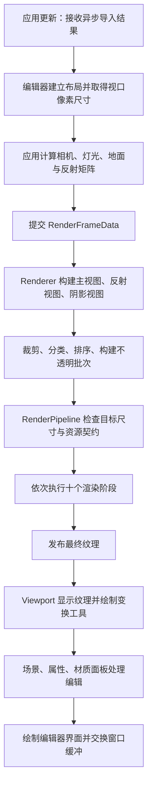

# 引擎架构与代码思路

本文依据 2026-10-01 的源码描述当前实现。项目使用 C++17 与 OpenGL 4.0 Core Profile（核心模式），当前是带编辑器工作流的实时渲染引擎；长期游戏引擎目标尚未转化为通用实体、脚本、物理等运行时系统。

## 分层与责任

| 层级 | 核心类型 | 实际责任 |
| --- | --- | --- |
| 应用编排 | `Application` | 窗口、上下文、相机、可编辑模型与灯光、导入提交、帧矩阵及面板协调 |
| 编辑器 | `EditorWorkspace`、各面板、`EditorViewportController` | 布局、参数输入、选择、拾取与变换操作 |
| 资产解析 | `FbxModelImporter`、`ImageLoader` | 将磁盘数据转换为不含图形上下文依赖的内存结果 |
| 渲染入口 | `Renderer` | 网格与材质资源表、场景提交、参数更新、构建三个渲染视图 |
| 渲染场景 | `RenderScene`、`PrimitiveSceneProxy`、`LightSceneProxy` | 保存渲染所需代理，生成可见项及批次 |
| 管线 | `RenderPipeline`、`RenderPass` | 固定阶段调度、资源契约、尺寸检查、统计与最终结果发布 |
| 绘制阶段 | 各 `Pass`（渲染阶段） | 准备绘制状态、绑定资源、提交几何或全屏处理 |
| 图形资源 | `Mesh`、`Material`、`Shader`、`Texture2D`、`Framebuffer` | 封装 OpenGL 对象与材质数据 |
| 诊断 | `RenderSubmissionStats`、`GpuPassProfiler` | 中央处理器（CPU）侧提交次数与图形处理器（GPU）阶段时间 |

源码入口：[应用](../src/Core/Application.cpp)、[渲染器](../src/Renderer/Core/Renderer.cpp)、[管线](../src/Renderer/Pipeline/RenderPipeline.cpp)。目录分层表达责任，但并不意味着各层完全无依赖：应用直接组合编辑器类型，反射和透明阶段引用前向阶段的绘制方法。

## 一帧如何产生

`Application::Update()` 非阻塞检查资产解析结果，并在主线程建立 GPU 资源。`Render()` 先建立界面，得到中央视口大小，再构造 `RenderFrameData`。Renderer 根据帧数据构建三个局部 `RenderView`，同步执行管线，返回 Present（最终合成）阶段拥有的颜色纹理。

视口工具和属性面板在场景渲染之后处理部分修改，因此这些参数通常在下一帧场景绘制中生效。最终纹理是借用资源；编辑器不负责删除，也不能跨目标重建长期缓存其编号。

## 数据类型为什么分开

- `EditableModel` 保存用户侧模型身份、根变换及分段绑定，方便整模型操作。
- `PrimitiveSceneProxy` 保存某个分段的网格、有效材质、世界变换、包围球与队列属性。
- `RenderView` 保存一个相机/投影下的可见结果；同一对象在主视图与反射视图的可见性和深度可能不同。
- `RenderItem` 是当帧绘制快照，包含资源指针、排序身份与变换。
- `OpaqueRenderBatch` 是相邻同资源绘制项的范围，不拥有网格或材质。
- `RenderFrameData` 传递相机、灯光投影、反射和视口信息；`RenderPassContext` 在执行期借用视图、内置几何与设置。

这种拆分让场景编辑与绘制提交具有不同生命周期，后续可在视图构建阶段增加可见性策略，而无需让每个 Shader（着色器）理解模型管理。

## 资源所有权与退出顺序

Renderer 的 `unique_ptr`（独占所有权指针）资源表拥有场景网格，`MaterialResourceStore` 拥有基础材质和实例。材质通过 `shared_ptr`（共享所有权指针）持有纹理。各渲染阶段拥有自己的着色器、目标与缓冲；管线拥有阶段。场景代理使用非拥有指针。

删除模型必须先注销图元；当前应用随后释放网格，再删除实例材质和基础材质。Renderer 拒绝删除仍被图元引用的资源，材质表拒绝删除仍有子实例的父材质；不可见对象也参与引用检查。

`Application::Shutdown()` 先关闭编辑器和导入任务，再清理模型与 Renderer，最后销毁窗口及 OpenGL 上下文。图形资源析构调用 OpenGL，因此这一顺序是必要约束。解析面板析构等待尚未完成的任务，其后台任务只持有 CPU 数据。

## 当前设计的价值与成本

| 设计 | 已解决的问题 | 当前成本与边界 |
| --- | --- | --- |
| 强类型资源句柄 | 区分网格/材质身份，校验资源有效性，允许共享 | 槽位只增加、不复用；并非通用资产标识 |
| 稳定地址有效材质 | 父材质更新后无需重建所有代理指针 | 解析与依赖遍历在 CPU 上执行，当前规模下线性处理 |
| 固定阶段与资源契约 | 明确纹理来源、内容阶段与失败帧行为 | 不自动排序，不分配资源池，也不拦截所有 OpenGL 调用 |
| 多视图独立列表 | 正确处理反射/阴影的可见性差异 | 每帧三次遍历场景，重复变换包围体与填充容器 |
| 共享前向绘制方法 | 标准、透明、反射复用材质与光照逻辑 | Reflection/Translucency 与 Forward 存在直接耦合 |
| 应用集中编排 | 当前导入、模型、工具与帧数据流程易追踪 | `Application.cpp` 同时包含演示场景、资产提交和灯光投影策略，修改范围较集中 |

这些成本是代码分析结果，不构成本轮重构建议。是否拆分应用编排、增加缓存或更换资源系统，应由已有问题和使用需求决定。

## 渲染能力边界

当前使用前向光照，无延迟光照缓冲。PBR（基于物理的渲染）采用微表面直接光照，但环境反射不是完整 IBL（基于图像的照明）。NPR（非真实感渲染）在统一表面片段着色器内选择卡通分支，轮廓另设阶段。

场景是会话内平面模型列表，FBX（模型交换格式）导入烘焙为静态几何；没有运行时骨骼动画、持久化场景或实体组件系统。阴影只有一张二维深度图；自动曝光、级联阴影与头发高光尚未实现。

继续阅读：[场景与视图](rendering/scene-and-views.md)、[管线与资源](rendering/pipeline-and-resources.md)、[编辑器工作流](editor/workflows.md)。
