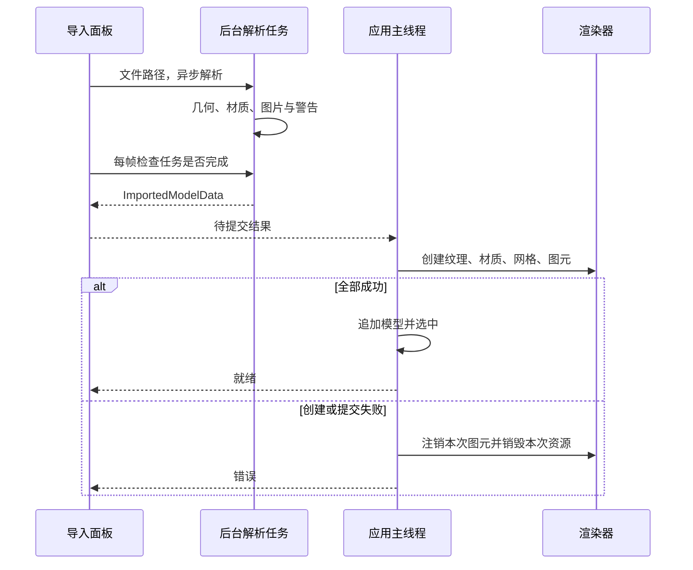

# 静态模型与图片导入

实现入口：[FBX 导入器](../../src/Assets/Import/FbxModelImporter.cpp)、[图片解码](../../src/Assets/Import/ImageLoader.cpp)、[中间数据](../../src/Assets/Import/ImportedModelData.h)、[导入面板](../../src/Editor/AssetImportPanel.cpp)、[应用提交](../../src/Core/Application.cpp)。FBX（模型交换格式）导入采用 ufbx（FBX 解析库），图片由内存解码后再上传。

## 两阶段设计

CPU（中央处理器）后台任务不调用 OpenGL，也不修改应用场景。面板使用 `std::async`（标准异步任务），每帧以零超时检查结果；等待提交时界面显示上传状态。GPU（图形处理器）资源创建由拥有图形上下文的主线程执行，这部分目前同步进行，大模型上传仍可能产生单帧停顿。

关闭时等待后台解析结束；没有任务取消或分帧上传。状态依次为空闲、解析中、待提交、就绪或错误。

## 几何转换

导入器将目标坐标约定设为右手系、Y 向上、米单位，评估源文件蒙皮姿态。按节点的材质分段遍历面，跳过孔洞和不足三个顶点的面，使用库的三角化生成三角形。

对仍处于局部空间的评估几何，位置乘节点几何到世界矩阵，法线使用对应法线变换。最终顶点烘焙到统一模型数据坐标，分段的 `localToWorld` 设为单位矩阵；运行时编辑再叠加模型根变换。

UV（纹理坐标）默认翻转 V。根据烘焙后的三角形边和 UV 差生成切线，退化纹理坐标提供回退，保存副切线方向符号。随后按完整顶点记录去重生成索引，失败时保留展开三角形和顺序索引，并记录警告。

每个分段计算轴对齐范围、球心和包围半径，整个模型也汇总范围。源文件骨骼和动画不会成为运行时资源；“评估源姿态”不等于支持运行时骨骼动画。

## 材质与图片解析

解析基础颜色、金属度、粗糙度、透明度和基础颜色纹理。自动导入当前聚焦基础颜色，不会自动推断法线、ORM（遮蔽、粗糙度、金属度）、面部阴影等数据图语义。

文件纹理优先读取内嵌内容；外部纹理按文件提供的路径、模型目录相对路径和同级 `textures` 目录搜索，并发现 PNG（便携式网络图形）和 JPEG（联合图像专家组压缩图像）候选。缺路径时尝试匹配文件名，兼容数字重复后缀并记录警告。候选发现不等于自动绑定全部纹理。

缺失或无法解码的基础颜色图记录警告，材质可回退到颜色参数。上传阶段将已解码颜色图创建为 sRGB（标准红绿蓝颜色空间）纹理，并通过共享指针供本次导入材质复用。不同模型重复导入不会跨模型去重。

## 事务式场景追加

`CommitImportedModel()` 先建立临时 `EditableModel`（可编辑模型），预留资源追踪容器。依次创建纹理、材质、带索引网格与图元；每个分段记录图元编号、局部变换、包围球、实际材质句柄和名称。

全部完成后生成会话内 `ModelId`（模型身份编号），分配唯一名称并追加模型列表，再切换编辑器选择。原模型保留；同名模型使用 `_001` 等后缀。

异常或无效索引触发本次资源回滚：先注销已提交图元，再释放网格，并按实例先于基础材质的顺序清理材质；纹理由共享引用释放。模型列表已有内容不参与本次回滚。该结构不构成跨线程资产数据库，也没有磁盘缓存、热更新或场景保存。

## 验证和操作

[ImageLoaderTests](../../tests/Assets/Import/ImageLoaderTests.cpp) 与 [FbxModelImporterTests](../../tests/Assets/Import/FbxModelImporterTests.cpp) 覆盖图片、路径、几何和导入结果。编辑器使用 `File > Import FBX...`（文件菜单中的导入入口）。连续导入两次后移动第二个模型，检查各自分段、材质与移除行为；故意缺少纹理时检查警告和颜色回退。外部资产画面与交互待用户验收。

## 单位、尺寸与聚焦（2026-10-02）

FBX 继续由 ufbx 使用 `target_unit_meters=1.0`、`ADJUST_TRANSFORMS` 转换到米。局部几何只乘一次 `geometry_to_world`，已在世界空间的评估蒙皮位置不重复乘节点矩阵；导入模型根 Scale 默认 1，不再追加单位乘数。

`sourceUnitMeters` 记录当前文件 `UnitScaleFactor` 对应的 `scene.settings.unit_meters`，只供诊断。`original_unit_meters` 可能描述历史创作单位，不用于当前比例；缺少有效显式属性时显示 unknown 并提示 ufbx 默认解释。Asset Import、Inspector、日志显示源单位及米制 X/Y/Z 范围，这是烘焙姿态全模型包围盒，不包含运行时根 Transform，也不等于角色身高。非有限顶点、分段包围球或整体尺寸导致导入失败，避免无效值进入 GPU 提交。

默认程序化正方体直接使用米制坐标：边长 2 米，局部范围 [-1,1]，根 Scale=1。项目约定 1 单位=1 米，FBX 与默认网格共用此尺度；世界边界、拾取和绘制使用 `根矩阵×分段局部矩阵`。启动场景实现见 [启动场景与相机](../editor/startup-scene.md)。

上传成功后保存稳定 ModelId 的一次性聚焦请求。等视口可见且宽高有效，先设置实际宽高比，再解析对象 ID 聚焦。失败导入不发请求，F 使用同一路径；对象不存在时忽略请求，消费后不持续覆盖相机操作。

实际 Lumine FBX 本轮检查导入 51 个分段、19 个蒙皮变形器，源单位 0.01 m/unit。四个武器辅助分段远离角色，全模型尺寸约 101.061×29.767×16.224 米。普通导入保留内容和远距离分段警告，完整模型聚焦仍可能令主体较小；Face Shadow 演示沿用已有辅助分段聚焦排除策略。通用导入不猜测单位或删除几何，异常分段应在制作软件核对。

实际源码参考与本项目适配：

- [Filament ViewerGui.cpp，3630bd4](https://github.com/google/filament/blob/3630bd4e7348fdc270545acc7dc4bb66d9e43aa8/libs/viewer/src/ViewerGui.cpp)：`fitIntoUnitCube()` 根据包围盒最大轴长生成根矩阵。本项目参考根变换边界，保留 FBX 米制尺度，用相机聚焦调整观看大小。
- [OGRE-Next OgreNode.cpp，475f783](https://github.com/OGRECave/ogre-next/blob/475f783d76f21b530e718aab4a548cdd9a222e50/OgreMain/src/OgreNode.cpp)：节点 Scale 修改变换并标记缓存失效。本项目复用现有 Transform/图元更新，不重建网格。
- [Canavar AssimpModelImporter.cpp，230b44d](https://github.com/berkbavas/CanavarGraphicsEngine/blob/230b44d4feb3592406f78f6aed47ea54cbdb93bd/Canavar/Engine/Source/Canavar/Engine/Util/AssimpModelImporter.cpp)：保留节点矩阵，区分节点和网格。本项目沿用静态烘焙，以用例验证层级变换和单位只应用一次。
- [NPR-Studio ToonViewerApp.cpp，092bb7a](https://github.com/Obi-Nnamdi/NPR-Studio/blob/092bb7a3a3a62ab8eae2b3c51907b144fa27f794/main_code/npr_studio/ToonViewerApp.cpp)：查看器使用固定相机初值。本轮对照后选择依据实际视口与世界包围球聚焦，避免固定距离随资产尺度失效。

验证：构建及 15 项 CTest 通过。新 FBX 用例用米/厘米创作同一三角形，并设置父 Scale=2、子平移，验证位置和尺寸一致；历史单位字段故意不同，验证诊断用当前单位。真实角色 FBX 导入检查通过。默认、Material Lab、Material Instance Lab、透明、256 实例和 Face Shadow 六种场景均完成隐藏窗口短时启动，日志进入实际 Forward 提交，未发现明显初始化、Shader 编译/链接或管线错误。画面与交互待用户验收，本轮没有新增 RenderDoc 性能基准，也未改动法线贴图采样或绑定。
